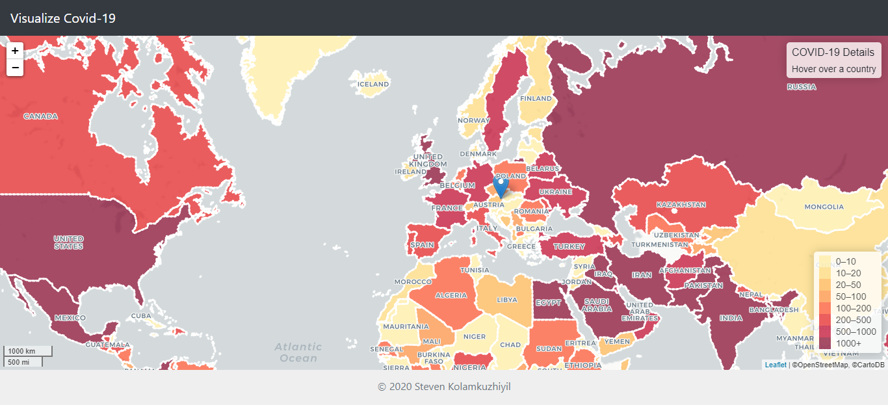

# VisualizeCovid19

A webapp which pulls recent COVID-19 data from verified sources and visualizes them using Leaflet.
The COVID-19 data is updated every day by a scheduler which merges the data with the geojson file used to display each countries cases.

COVID-19 Data: https://opendata.ecdc.europa.eu/covid19/casedistribution/

## Getting Started

Clone this repository and run the Spring application.

### Used Technologies

Java 8, Spring-Web, Thymeleaf, Javascript, Leaflet, CSS, HTML, Bootstrap, JQuery, Maven
